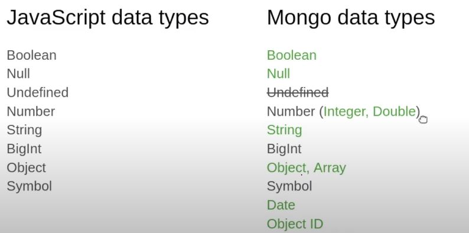

## mongodb interact
`- we can interact with mongodb in three different ways.
    - callback
    - promises
    - async/await
`

# MongoDB

## basic command

mongosh -u root -p password

> show dbs;
> use <db-name>;
> db;
> db.<collection>.<command>(find, insert, update, updateMany, etc..)

------
1. create db
use hoangmaimarket

2. create collection
db.category

3. insert
db.category.insert({name: 'laptop'})

4. 
 show collections
 db.getCollectionNames()
 db.category.find()

 
